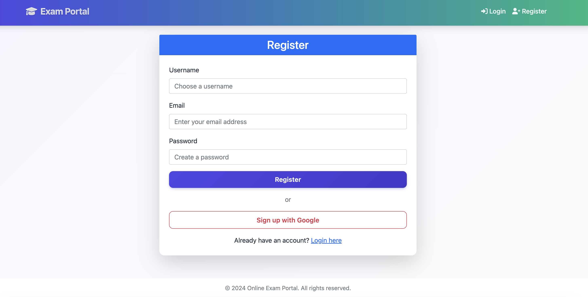
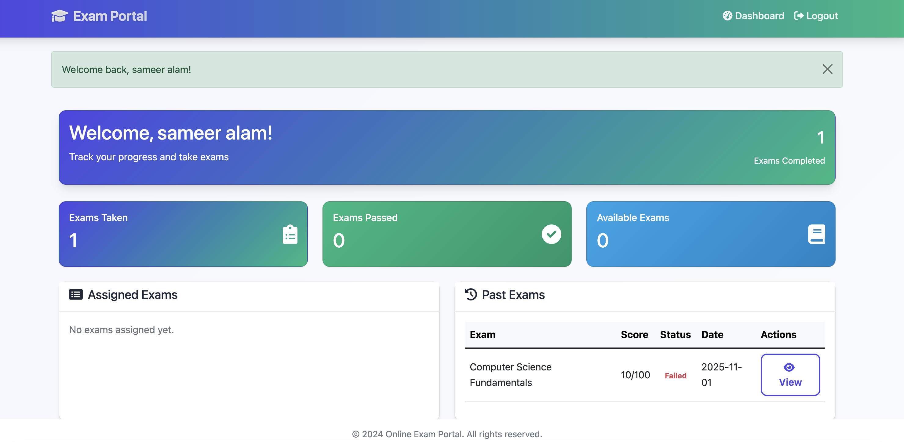

# Screenshots & Architecture

This document showcases **screenshots** of key features in the Secure Exam Portal and explains the **project architecture**.

---

## Project Architecture

```
Flask App Factory
┌─────────────────────┐
│ create_app()        │
│ - initialize app    │
│ - load config       │
│ - init DB & Login   │
│ - register blueprints
└─────────┬───────────┘
          │
          ▼
┌─────────────────────┐
│ Blueprints          │
│ - auth_bp           │ → Handles login, register, Google OAuth
│ - admin_bp          │ → Admin dashboard, user & exam management
│ - student_bp        │ → Student dashboard, exams, results
└─────────┬───────────┘
          │
          ▼
┌─────────────────────┐
│ Models              │
│ - User              │ → Local & Google OAuth login info
│ - Exam              │ → Exam info & questions
│ - Question          │ → Questions for exams
│ - ExamResult        │ → Student exam attempts
│ - UserAnswer        │ → Individual answers
└─────────────────────┘
```

---

## Screenshots

### Google Login

Users can log in using Google account for easy authentication.





---
